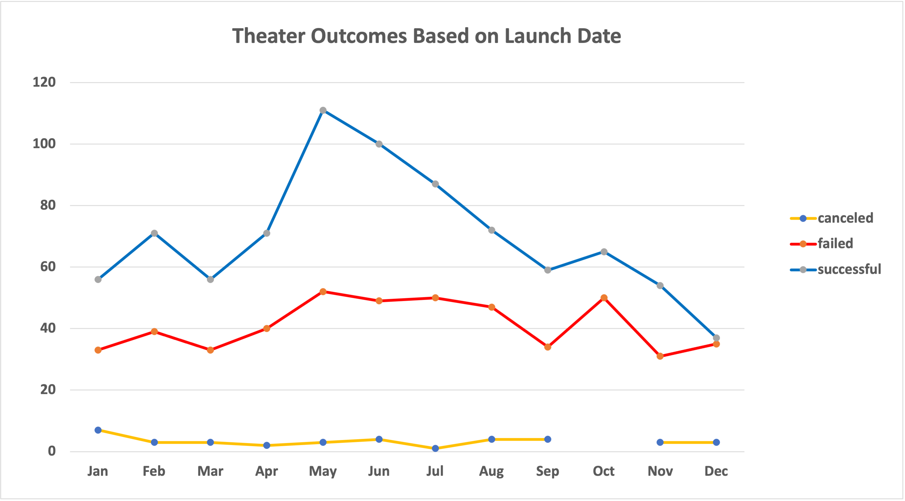

# Crowdfunding report for Louise

## Overview of Project

### Purpose
- We are helping a playwright Louise for her crowdfunding campaign to fund her play "Fever". Her estimate budget was over $10,000 and she wanted us to help her check if this is reasonable. We will be using excel to analysis ton of previous data on crowdfunding and see what are the key factors for a successful campaign.

## Analysis and Challenges

### Analysis of Outcomes Based on Launch Date

### Analysis of Outcomes Based on Goals

### Challenges and Difficulties Encountered
- The first challenge was that there was huge amount of data to look at, but the pivot table was a very good solution to look at specific items and compare their relationships.

- Another difficulty I encountered was debugging. Some blank spaces/rows kept showing up in my pivot table and I couldn't delete it from the pivot table page. I searched on google and use youtube but no exact answer found. But from the videos and articles I read online, I figured that maybe the problem was the way I selected the data on the original sheet. I tried again selecting only cells with data, but not the whole sheet, the blanks gone! This was such an easy part in the class, but I spent an hour debugging, kinda time-taking but worth it.

## Results
### Two Conclusions about the Theater Outcomes by Launch Date
- Q2 seems to be the best time period of a year to do a crowdfunding campaign as it has an increasing trend of successful data and campaigns launched in May got the highest successful rate.

- The other thing about the launch date of

### One conclusion about the Outcomes based on Goals
- It has an obvious declining trend of successful rate when the budget is from less than $1,000 to $30,000. If Louise sticks to her budget at $10,000, she will still have over 50% successful rate for her play crowdfunding campaign, based on the previous similar campaigns data.

### limitations of this dataset
- There is only an overall budget amount, but no detailed break down data from the previous crowdfunding campaigns. So it is a bit ambiguous for Louise to decide the break down of the budget for a successful campaign.

### Other tables/graphs recommendation
- We can also create a histogram chart of the budget of successful campaigns in the subcategory of plays in the US to see the distributions. A boxdot chart could also be created to see the outliers of successful compaigns and how do their budgets look like.
