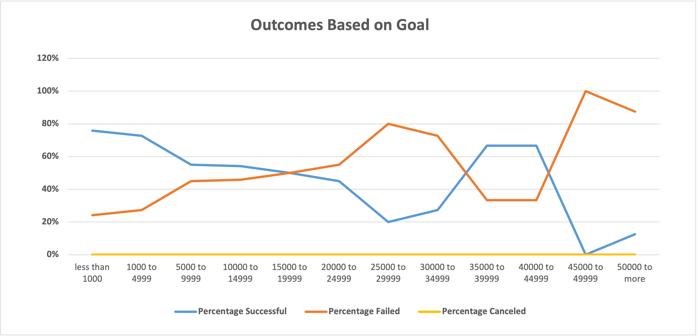

# Crowdfunding Report for Louise

## Overview of Project

### Purpose
- We are helping a playwright Louise for her crowdfunding campaign to help fund her play "Fever". Her estimate budget is over $10,000 and she wants us to help her check if this is reasonable. We will be using excel to analyze tons of data on other crowdfunding projects and see what are the key factors for a successful campaign, and our focus will be on the similar categories, which are theaters and plays in the US.

## Analysis and Challenges

### Analysis of Outcomes Based on Launch Date

- This is a visualization of the successful, failed and canceled numbers of crowdfunding campaigns of the "Theater" category based on their launch date. We want to check if seasonality plays a role in making a campaign successful and give Louise an idea of what months would be the best time to launch a campaign like this.

### Analysis of Outcomes Based on Goals

- This chart shows the the successful, failed and canceled rate of the crowdfunding campaigns in the "plays" catergory based on their budget goal. From this, we want to see if goal setting will influence the outcomes. If a reasonable budget goal is one of the key factors to the success of such campaigns and how does it look like.

### Challenges and Difficulties Encountered
- The first and the biggest challenge was that there was a huge amount of data to look at, clean and dig to find some related connections that might provide Louise useful insights. We used pivot table to compare different items and find correlations. We filtered the table in different ways and narrowed our analysis to the two main points, which were outcomes based on launch dates and outcomes based on goals.

- Another difficulty I encountered was debugging. Some blank spaces/rows kept showing up in my pivot table and I couldn't delete them from the pivot table page. I searched on Google and YouTube but no exact answers found. However, from the videos and articles online, I figured that the problem might be the way I selected the data on the kickstarter original sheet. I tried again selecting only cells with data, but not the whole sheet, the blanks gone! Selecting data was touched slightly in the class, but I spent an hour debugging. It was very time-consuming but the research process worth it.

## Results
### Two Conclusions about the Theater Outcomes by Launch Date
- Looking at the blue successful line, we found an upclimbing trend from March and it hit the highest in May. This indicates that campaigns launched in May might get the most successful outcomes. Although the successful outcomes trend started to fall since May, the successful outcomes from May to July were higher than the other months. So it can be a good option for Louise to launch her campaign in April, June and July.

- The blue successful outcome line and the orange failed outcome line almost met in December, showing that December might not be an ideal choice to launch a crowdfunding campaign, because the successful rate could be the lowest of the year.

### One conclusion about the Outcomes based on Goals
- In this chart, the blue successful percentage line had an obvious declining trend between the range of less than $1,000 to the range of $25,000 to $29,999. Campaigns under the budget of $19,999 had a the successful rate over 50%. Therefore, if Louise sticks to her budget at $10,000, she would still have over 50% successful rate for her campaign. But the less budget she plans, the higher successful rate it will be, based on the previous similar campaigns data.

### limitations of this dataset
- This dataset was not detailed enough for Louise's campaign. It only provided an overall budget amount, but no detailed or break-down budget data to take reference to. And if there are many outliers, it could influence the overall analysis results.

### Other tables/graphs recommendation
- We can create histogram charts of the successful campaigns in the category of the theaters and the plays in the US to see the budget range distributions. A boxdot chart could also be created to see the outliers of successful campaigns and go in-depth to check if we can find how their data influences the overall distribution. 
